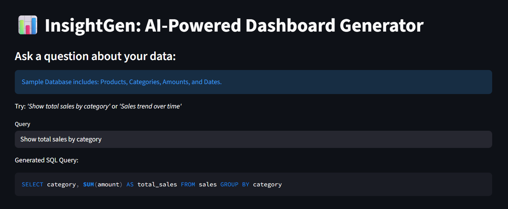
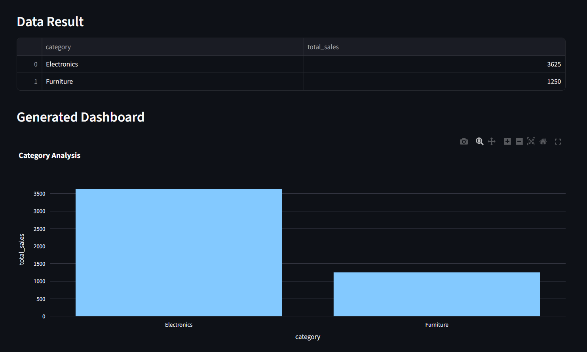

# 📊 InsightGen: GenAI-Powered Dashboard Generator

InsightGen is an end-to-end Generative AI tool that allows business users to "talk" to their databases. It translates natural language questions into optimized SQL queries and automatically generates interactive dashboards.

---

## 🚀 Key Features
- **Natural Language Querying**: Ask questions like "What are the sales trends for last month?"
- **Automated SQL Generation**: Uses Llama 3.3 70B via Groq for high-accuracy SQL creation.
- **Dynamic Visualization**: Automatically renders Line, Bar, or Category charts using Plotly.
- **Instant Insights**: No SQL knowledge required for end-users.

---

## 🛠️ Tech Stack
- **AI Framework**: LangChain
- **LLM**: Groq API (Llama-3.3-70b-versatile)
- **Frontend**: Streamlit
- **Database**: SQLite
- **Visualization**: Plotly Express

## 📋 Prerequisites
- Python 3.10+
- A Groq API Key (Free at [console.groq.com](https://console.groq.com))

---

## ⚙️ Installation & Setup

1. **Clone the repository:**
   ```bash
   git clone [https://github.com/YOUR_USERNAME/InsightGen.git](https://github.com/YOUR_USERNAME/InsightGen.git)
   cd InsightGen

2. **Create and activate a virtual environment:**
   ```bash
   python -m venv venv
   # Windows:
   venv\Scripts\activate
   # Mac/Linux:
   source venv/bin/activate

3. **Install dependencies:**
   ```bash
   pip install -r requirements.txt

4. **Environment Configuration: Create a .env file in the root directory and add your key:**
   ```bash
   GROQ_API_KEY=your_actual_api_key_here

5. **Run the application:**
   ```bash
   streamlit run app.py

---

## 🌐 Live Demo
You can access the live version of the application here:  
👉 **https://insightgen-77bcmnq6p6s34sxfbwxhip.streamlit.app/** 


---

## 📸 Screenshots

### 1. Natural Language to SQL
The user enters a question in plain English, and the AI generates the corresponding SQL query.


### 2. Automated Data Visualization
The system executes the query and automatically selects the best visualization type.

